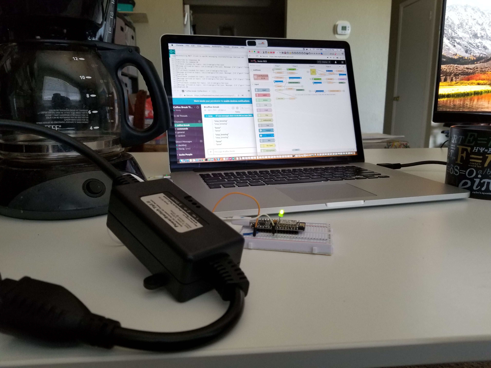

<b><u>Skill Level</u></b>: Beginner
 <b><u>N.B</u></b>: All services used in this repo are Lite plans. Don't forget to star this repo if you like it.

# Coffee Brewing IoT

> The diagram architecture is getting updated, it will be posted soon.

## Introduction

The idea behind this project is to provide a hands-on fun workshop using Node-RED and Watson's cognitive solutions for audio conversations. Audio tends to have its own challenges and this step-by-step tutorial hopefully can help you enjoy coding and also target your goals through this experience.

This pattern uses the Speech to Text, Text to Speech and IoT Platform to take in audio sentence and translate that into a command to be sent to a registered device. A registered device is a device that is connected to the IoT Platform and is ready to send topics and receive commands. This device can be at your choice of design, I chose to use a Nodemcu (ESP8266 WiFi based). Between the audio sentence and the command process, there's IFTTT to Slack messaging going through. Every time a command is sent to the device, this same command will be displayed on Slack channel and after the command will take place, like brewing coffee or turn an led on/off and etc. The device will send sentence that it started the process when it turns on and otherwise when it turns off.

After the completion of this tutorial, this application will record your talk and send it over to Watson's services to retrieve, based on your request, the weather data of a city.. Or can send commands and receive responses through a conversation, for example, to turn on lights or to play a music and many more. Then IFTTT will trigger events each time there's a request coming from the microphone and it will be posted on the Slack the specific event made.

If you'd like to watch the videos, I have one video shows how the coffee machine is brewing the coffee after command is sent and the other one does not include the coffee machine but it behaves as if it was there. The reason for the second video is because my hdmi attached screen did not play the sound in the first video.

* [Video with coffee machine](https://youtu.be/JYZVim6CiUw).

* [Video with audio heard](https://youtu.be/zBqWUEjVTzs).

### Before you begin

* Create an IBM Cloud account if you don't have an existing one: [Sign up](https://console.ng.bluemix.net/registration/?target=/catalog/%3fcategory=watson).

## TUTORIAL STEPS

* Step 1 & 7 - [Node-RED](steps/nodered.md): Microphone and Audio player
* Step 2 - [Speech-To-Text](steps/stt.md)
* Step 3 & 5 - [Internet of Things](steps/iot.md)
* Step 4 - [IFTTT and Slack](steps/ifttt.md)
* Step 6 - [Text-To-Speech](steps/tts.md)

## Important Naming Notes

* Bluemix aka IBM Cloud

## Useful links

* [IBM Cloud](https://bluemix.net/)  
* [IBM Cloud Documentation](https://www.ng.bluemix.net/docs/)  
* [IBM Cloud Developers Community](http://developer.ibm.com/bluemix)  
* [IBM Watson Internet of Things](http://www.ibm.com/internet-of-things/)  
* [IBM Watson IoT Platform](http://www.ibm.com/internet-of-things/iot-solutions/watson-iot-platform/)   
* [IBM Watson IoT Platform Developers Community](https://developer.ibm.com/iotplatform/)
* [Hovig's Github](https://github.com/hovig?tab=repositories)
* [IBM Watson Tone Analyzer](https://console.bluemix.net/docs/services/tone-analyzer/index.html#tone-analyzer-endpoints)

## License
[Apache 2.0](LICENSE)
