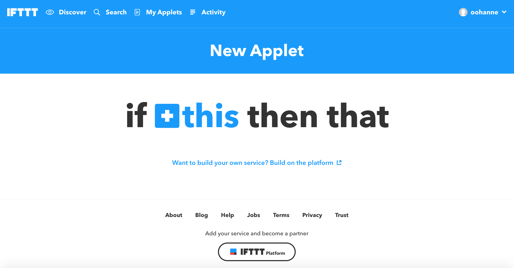
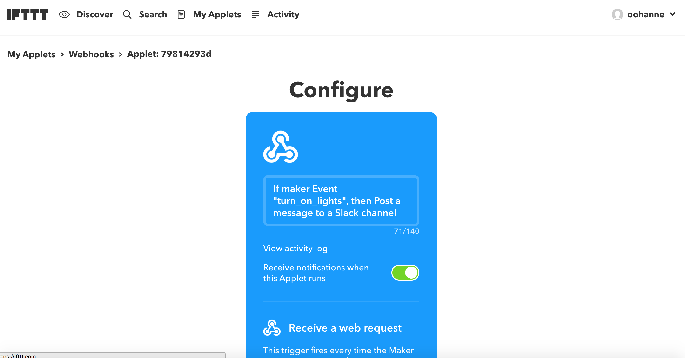
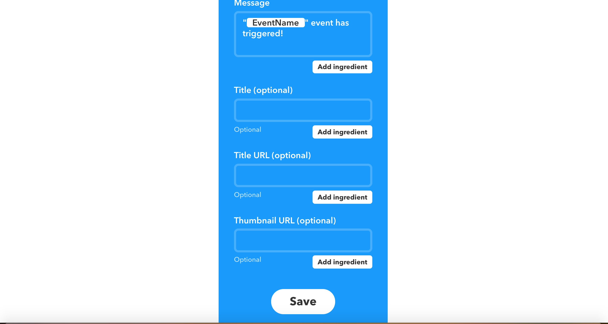

# IFTTT - IF THIS THEN THAT

> [IFTTT](https://ifttt.com/discover)

Go to [webhooks settings page at IFTTT](https://ifttt.com/services/maker_webhooks/settings) to copy the URL that has your key:

```
URL: https://maker.ifttt.com/use/<key>
```

Paste it in the `http request node` in Node-RED editor and make sure the `Method` in there is selected: `POST`.

<hr>

### Slack

> Important

Create a [Slack account](https://slack.com): `YOUR_SLACK_NAME.slack.com` or make sure you're the admin or have the credentials of an existing one. Next create a channel name it as per your project's theme (in this pattern, it's called `commands`).

<hr>

* Now go to the following [link](https://ifttt.com/my_applets) to create your applets or click on `My Applets` tab.



* Click on  and search for `Webhooks` and click on it.

* Now click on the next  and search for `Slack` (you can always choose any other applet that you want). Accept the associated credentials of the Slack. Then follow the steps like in the following images:







#### Apply the same way for the rest of the events. The events in this tutorial are:

* `turn_on_lights`
* `turn_off_lights`
* `play_music`
* `jazz`
* `rock`


<hr>
